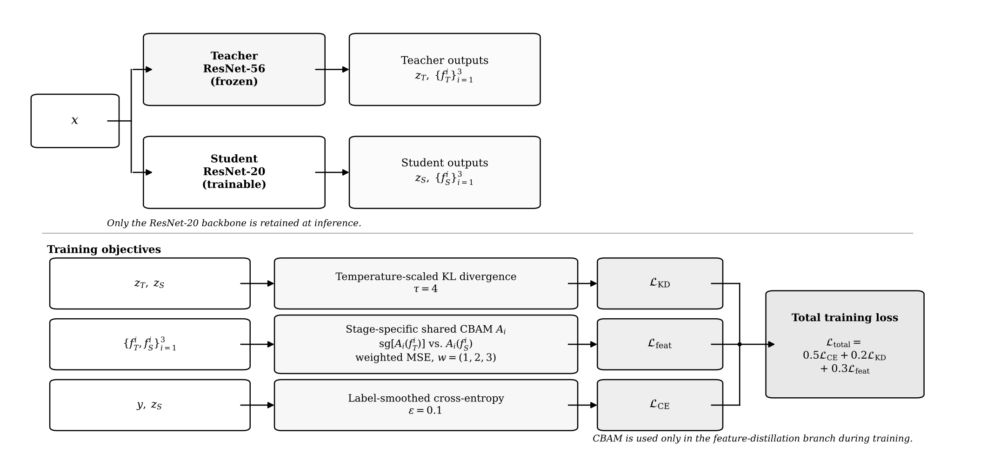

# Feature-Based Knowledge Distillation with CBAM Attention

This repository contains the PyTorch implementation and experimental materials for a B.Sc. thesis on knowledge distillation for CIFAR-100.

The method uses a ResNet-56 teacher and a ResNet-20 student. The CBAM-KD objective combines supervised classification, temperature-scaled logit distillation, and CBAM-guided matching of intermediate feature maps from the three residual stages.

CBAM is used only in the feature-distillation branch during training. It is not part of the deployed student network, so the final model remains a standard ResNet-20 with no additional inference-time parameters or attention-related inference cost.



## Highlights

- ResNet-56 teacher and ResNet-20 student on CIFAR-100.
- Stage-wise CBAM-guided feature matching at all three CIFAR ResNet stages.
- Temperature-scaled logit distillation combined with supervised classification.
- CBAM is used only during training; the deployed student remains an unchanged ResNet-20.
- Fixed 45,000/5,000 CIFAR-100 train/validation split, with the official test set reserved for final evaluation.
- Modular training, evaluation, checkpoint inspection, and t-SNE scripts.
- Two complete 250-epoch experimental runs with optimization seeds 42 and 2025.
- CPU smoke tests and GitHub Actions continuous integration.

## Results

The final pipeline was evaluated on CIFAR-100 using two independent training runs with seeds 42 and 2025. All models were trained for 250 epochs on an NVIDIA Tesla T4 GPU per run.

The table reports final test Top-1 accuracy using the checkpoint with the best validation accuracy.

| Seed | ResNet-20 baseline | ResNet-56 teacher | CBAM-KD |
|---:|---:|---:|---:|
| 42 | 68.05% | 71.81% | 69.92% |
| 2025 | 68.25% | 71.33% | 70.56% |
| **Mean** | **68.15%** | **71.57%** | **70.24%** |
| **Sample SD** | **0.14** | **0.34** | **0.45** |

Across the two runs, CBAM-KD improves the ResNet-20 baseline by **2.09 percentage points** on average while retaining the same ResNet-20 inference architecture.

These results show that the complete CBAM-guided distillation configuration improves over standard student training in the reported experimental setup.

Machine-readable values are available in [`results/main_results.csv`](results/main_results.csv).

### Experimental note

The standalone ResNet-20 baseline and ResNet-56 teacher were trained with standard cross-entropy. The CBAM-KD student used label smoothing (`epsilon = 0.1`) as part of the distillation training configuration.

The reported CBAM-KD objective is:

```text
L_CBAM-KD = 0.5 * L_CE
          + 0.2 * L_KD
          + 0.3 * L_feat
```

where `L_KD` is temperature-scaled logit distillation with `T = 4`, and `L_feat` is the CBAM-guided feature-matching loss.

Because the standalone baseline does not use the same label smoothing configuration, the improvement over the baseline should be interpreted as the effect of the complete CBAM-KD training setup rather than as an isolated estimate of the CBAM component alone.

## Feature-space visualization

t-SNE was applied to global-average-pooled features from the final residual stage. Selected visualizations are stored in [`results/figures/`](results/figures/).

Each model is projected independently, so the plots are intended for qualitative inspection of within-panel structure only. Absolute positions and distances should not be compared directly across separately fitted t-SNE projections.

## Repository layout

```text
configs/                  Versioned experiment configurations
src/cbam_kd/              Models, CBAM, losses, data, metrics, and training utilities
scripts/                  Training, evaluation, pipeline, and visualization CLIs
kaggle/                   Kaggle kernel entry points and metadata
notebooks/                Exploratory notebook and a compact demo
tests/                    CPU smoke tests
results/                  Result tables and selected figures
checkpoints/README.md      Optional checkpoint manifest
docs/REPRODUCIBILITY.md   Implementation and reproducibility notes
```

Datasets, model weights, logs, raw Kaggle downloads, archives, and generated thesis files are deliberately excluded from Git.

## Installation

Python 3.10 or newer is recommended.

```bash
git clone https://github.com/maryamjbr/cbam-kd-cifar100.git
cd cbam-kd-cifar100

python -m venv .venv
source .venv/bin/activate  # Windows: .venv\Scripts\activate

python -m pip install --upgrade pip
pip install -e ".[visualization,dev]"
```

CIFAR-100 is downloaded automatically by TorchVision on first use.

## Quick verification

```bash
pytest -q
```

The tests cover model shapes and parameter counts, CBAM-KD gradient flow, and core distillation behavior. Checkpoint compatibility is also checked when optional checkpoint files are available.

## Training

Train the ResNet-20 baseline and ResNet-56 teacher:

```bash
python scripts/train_baseline.py --config configs/resnet20_baseline.yaml
python scripts/train_baseline.py --config configs/resnet56_teacher.yaml
```

The teacher checkpoint produced by the second command is saved at:

```text
runs/resnet56_teacher/best.pth
```

Train the CBAM-KD student using that teacher:

```bash
python scripts/train_kd.py \
  --config configs/cbam_kd.yaml \
  --teacher-checkpoint runs/resnet56_teacher/best.pth
```

This explicit checkpoint path makes the three training commands directly runnable in sequence after cloning the repository; no pre-existing `.pth` file is required.

Run the complete baseline, teacher, CBAM-KD, evaluation, and t-SNE workflow:

```bash
python scripts/run_pipeline.py \
  --seed 42 \
  --output-root runs/seed_42
```

For a quick end-to-end check:

```bash
python scripts/run_pipeline.py \
  --seed 42 \
  --epochs 1 \
  --output-root runs/smoke_test
```

The reported experiments were run with seeds `42` and `2025` while keeping the train/validation split fixed.

## Evaluation and visualization

Evaluate a ResNet-20 checkpoint:

```bash
python scripts/evaluate.py \
  --config configs/resnet20_baseline.yaml \
  --model resnet20 \
  --checkpoint /path/to/best.pth
```

Inspect checkpoint architecture compatibility and file hashes:

```bash
python scripts/inspect_checkpoints.py /path/to/checkpoint.pth
```

See each script's `--help` output for the complete set of options.

## Distillation objective

Let `z_s` and `z_t` denote the student and teacher logits, `y` the ground-truth labels, and `F_s` and `F_t` the intermediate feature maps.

The logit-distillation term is:

```text
L_KD = T^2 * KL(
    softmax(z_t / T)
    ||
    softmax(z_s / T)
)
```

with:

```text
T = 4
```

The full training objective is:

```text
L_CBAM-KD = 0.5 * L_CE
          + 0.2 * L_KD
          + 0.3 * L_feat
```

`L_feat` is a weighted mean-squared error between CBAM-refined teacher and student features at the three residual stages. Relative stage weights are `1:2:3`, giving greater weight to deeper representations.

A separate CBAM block is used at each stage and shared between the teacher and student feature tensors for that stage. The teacher network is frozen, and the attended teacher feature is treated as a stop-gradient target.

The CBAM blocks are optimized only during training and are discarded afterward. The deployed model is therefore the original ResNet-20 backbone.

## Reproducibility notes

The modular implementation in `src/` and `scripts/` is the maintained codebase for the reported thesis experiments. The exploratory notebook is retained in [`notebooks/original_experiment.ipynb`](notebooks/original_experiment.ipynb) for reference.

The final experiment pipeline uses:

- explicit student and teacher loss arguments;
- current validation features during evaluation;
- a fixed held-out validation subset for checkpoint selection;
- the official CIFAR-100 test set only for final evaluation;
- CBAM parameters included in the distillation optimizer.

Additional implementation details are documented in [`docs/REPRODUCIBILITY.md`](docs/REPRODUCIBILITY.md).

## Limitations

The reported results are based on two optimization seeds. Additional repeated runs would provide a more reliable estimate of experimental variance.

The standalone ResNet-20 baseline was trained with ordinary cross-entropy, while the CBAM-KD student used label smoothing as part of its training objective. A stricter component-level ablation would match all other training settings while varying only the feature-distillation branch.

## Attribution and citation

The CIFAR ResNet implementation follows the structure of Yerlan Idelbayev's [`pytorch_resnet_cifar10`](https://github.com/akamaster/pytorch_resnet_cifar10) and conventions from TorchVision's [`resnet.py`](https://github.com/pytorch/vision/blob/main/torchvision/models/resnet.py).

See [`THIRD_PARTY_NOTICES.md`](THIRD_PARTY_NOTICES.md) and [`licenses/`](licenses/) for licensing and attribution details.

If you use this work, cite the metadata in [`CITATION.cff`](CITATION.cff).

## License

Released under the [BSD 3-Clause License](LICENSE). Third-party components retain their original license terms.
