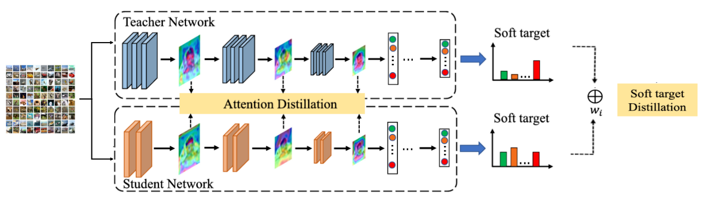
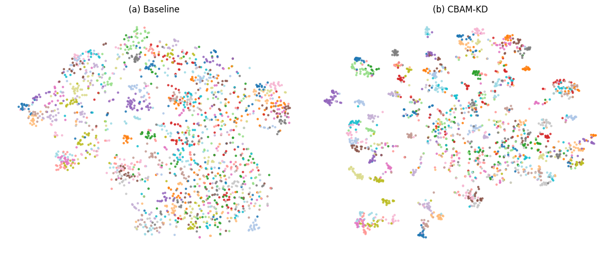
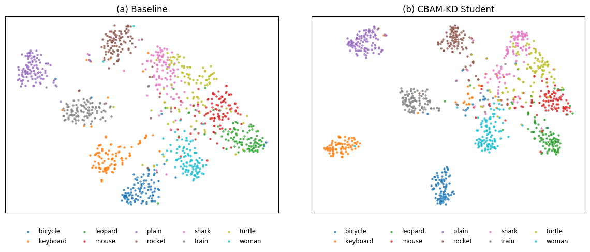

# Feature-Based Knowledge Distillation with CBAM Attention

PyTorch code and reproducibility materials for a B.Sc. thesis on feature-based
knowledge distillation for CIFAR-100. A ResNet-56 teacher transfers knowledge to
a ResNet-20 student through label supervision, temperature-scaled logit
distillation, and CBAM-refined intermediate feature matching.

CBAM is used only while training. The exported student remains a standard
ResNet-20, so attention adds no inference-time parameters or latency.



## Highlights

- Modular training, evaluation, checkpoint inspection, and t-SNE scripts.
- Deterministic 45,000/5,000 CIFAR-100 train/validation split.
- Separate configurations for the baseline, teacher, CBAM-KD, and vanilla-KD
  ablation.
- CPU smoke tests and GitHub Actions continuous integration.
- Two complete 250-epoch reproducibility runs using seeds 42 and 2025.

## Results

### Reproduced experiments

The modular pipeline was run for 250 epochs on NVIDIA Tesla T4 GPUs. Values are
CIFAR-100 test Top-1 accuracy.

| Seed | ResNet-20 baseline | ResNet-56 teacher | Vanilla KD | CBAM-KD |
|---:|---:|---:|---:|---:|
| 42 | 68.05% | 71.81% | 70.18% | 69.92% |
| 2025 | 68.25% | 71.33% | 70.17% | 70.56% |
| Mean | 68.15% | 71.57% | 70.175% | 70.24% |

Across the two seeds, CBAM-KD improves on the baseline by **2.09 percentage
points** on average. Its mean is 0.065 points above vanilla KD; with only two
seeds, this small difference should not be interpreted as a conclusive advantage
over logit-only distillation. Machine-readable values are in
[`results/reproduced_results.csv`](results/reproduced_results.csv).

### Historical thesis results

| Model | Role | Reported Top-1 |
|---|---|---:|
| ResNet-56 | Teacher | 72.55% |
| ResNet-20 | Student baseline | 68.03% |
| ResNet-20 CBAM-KD | Distilled student | 68.68% |

These are the original thesis-reported values and are kept separate from the
clean reruns above. Differences between the original notebook and the modular
implementation are documented in
[`docs/REPRODUCIBILITY.md`](docs/REPRODUCIBILITY.md).





## Repository layout

```text
configs/                  Versioned experiment configurations
src/cbam_kd/              Models, CBAM, losses, data, metrics, and training utilities
scripts/                  Training, evaluation, pipelines, and visualization CLIs
kaggle/                   Kaggle kernel entry points and metadata
notebooks/                Original experiment notebook and a compact demo
tests/                    CPU smoke tests
results/                  Small result tables and selected figures
checkpoints/README.md      Optional historical checkpoint manifest
docs/REPRODUCIBILITY.md   Known limitations and implementation differences
```

Datasets, model weights, logs, raw Kaggle downloads, archives, and generated
thesis files are deliberately excluded from Git.

## Installation

Python 3.10 or newer is recommended.

```bash
git clone https://github.com/maryamjbr/cbam-kd-cifar100.git
cd cbam-kd-cifar100
python -m venv .venv
source .venv/bin/activate  # Windows: .venv\Scripts\activate
python -m pip install --upgrade pip
pip install -e ".[visualization,dev]"
```

CIFAR-100 is downloaded by TorchVision on first use.

## Quick verification

```bash
pytest -q
```

The tests check model shapes and parameter counts, CBAM-KD gradients, and the
vanilla-KD objective. Checkpoint compatibility is tested automatically when the
optional historical checkpoint files are present.

## Training

Train individual models:

```bash
python scripts/train_baseline.py --config configs/resnet20_baseline.yaml
python scripts/train_baseline.py --config configs/resnet56_teacher.yaml
python scripts/train_kd.py --config configs/thesis_reconstruction.yaml
```

The KD configuration expects a teacher checkpoint at
`checkpoints/resnet56_cifar100_best.pth` by default. Change
`teacher.checkpoint` in the YAML file or pass `--teacher-checkpoint` to use a
different path.

Run the complete baseline, teacher, CBAM-KD, evaluation, and t-SNE workflow:

```bash
python scripts/run_pipeline.py \
  --seed 42 \
  --output-root runs/seed_42
```

Use `--epochs 1` for a quick end-to-end pipeline check. Run the vanilla-KD
ablation after the reference pipeline has produced matching baseline and teacher
checkpoints:

```bash
python scripts/run_vanilla_kd_pipeline.py \
  --seed 42 \
  --reference-root runs \
  --output-root runs/vanilla_seed_42
```

## Evaluation and visualization

Given a ResNet-20 checkpoint:

```bash
python scripts/evaluate.py \
  --config configs/resnet20_baseline.yaml \
  --model resnet20 \
  --checkpoint /path/to/best.pth
```

Inspect checkpoint architecture compatibility and hashes:

```bash
python scripts/inspect_checkpoints.py /path/to/checkpoint.pth
```

See each script's `--help` output for all options.

## Distillation objective

For student logits `z_s`, teacher logits `z_t`, labels `y`, and intermediate
features `F_s` and `F_t`, the objective is:

```text
L = w_ce * CE(z_s, y)
  + w_kd * T^2 * KL(softmax(z_t / T) || softmax(z_s / T))
  + w_feat * L_feature(F_s, F_t)
```

`L_feature` compares CBAM-refined maps at the three ResNet stages. The teacher
is frozen throughout student training.

## Reproducibility notes

The original notebook is retained at `notebooks/original_experiment.ipynb`.
During modularization, several issues were found in the original experiment,
including reversed student/teacher logits in one loss call, stale feature
tensors in validation, and test-set use during model selection. The current code
uses explicit argument names, current validation features, a held-out validation
split, and optimizes the distillation CBAM parameters.

The historical student checkpoint contains only a `state_dict`; optimizer,
scheduler, CBAM, and split state cannot be recovered. See the full
[reproducibility notes](docs/REPRODUCIBILITY.md) before comparing new runs with
the thesis.

## Attribution and citation

The CIFAR ResNet implementation follows the structure of Yerlan Idelbayev's
[`pytorch_resnet_cifar10`](https://github.com/akamaster/pytorch_resnet_cifar10)
and conventions from TorchVision's
[`resnet.py`](https://github.com/pytorch/vision/blob/main/torchvision/models/resnet.py).
See [`THIRD_PARTY_NOTICES.md`](THIRD_PARTY_NOTICES.md) and [`licenses/`](licenses/)
for details.

If you use this work, cite the metadata in [`CITATION.cff`](CITATION.cff).

## License

Released under the [BSD 3-Clause License](LICENSE). Third-party components
retain their original license terms.
